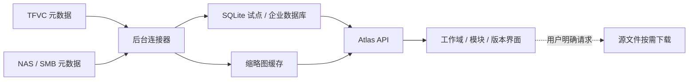

# 大规模资源加载与交接

更新时间：2026-07-14

## 加载原则

用户打开页面时不能现场递归扫描 TFVC 或 NAS。Atlas 先在后台建立轻量索引，页面只查询数据库并加载当前可见的预览图；PSD、3D 工程、高清图和原始文档始终按需获取。

## 索引策略

- TFVC：保存最后成功 changeset，后续只处理增量历史；不自动 `get` 全部源文件。
- NAS：以规范化路径、文件大小、修改时间为基础做增量扫描；定时抽样校验删除和移动。
- 批处理：初始建议每批 500 条元数据，失败项单独重试，不回滚整批。
- 预览：上传者提供 JPG/PNG；生成 320px 和 640px 两档缓存，原图仍按需读取。
- 去重：使用来源、规范化路径和版本标识做唯一键，不用文件名猜测同一资产。
- 状态：记录最后扫描时间、游标、失败数和连接器健康状态，管理端可重跑失败批次。

## 页面加载策略

| 场景 | 默认策略 |
| --- | --- |
| 模块列表 | 首屏 24 个，游标分页 |
| 内容预览 | 每页 40 个，只加载可视区域缩略图 |
| 下一页 | 空闲时只预取 1 页元数据和缩略图 |
| 超过 200 项 | 使用虚拟列表，避免 DOM 持续增长 |
| 搜索 | 服务端索引检索，300ms 防抖，取消过期请求 |
| 高清图/源文件 | 用户双击预览后仍不自动下载；点击获取才请求来源 |

“预加载”应当预加载下一屏的小图和元数据，而不是预下载源文件。GB 级工程包应由后台任务、断点续传和校验和处理，并向用户显示排队、传输、校验、完成或失败状态。

## 占用与并发

NAS 上“有人打开后无法修改或删除”通常来自应用打开方式、SMB share mode、lease/oplock 或权限策略。它与 TFVC 的 checkout/checkin lock 不同。

- Atlas 不绕过或强制解除来源锁。
- NAS 上传先写入暂存文件，校验完成后再提交最终文件名和数据库记录。
- TFVC 修改通过公司既有 workspace、checkout/checkin 和冲突规则执行。
- 页面显示“被占用、无权限、版本冲突、来源离线”等可区分状态。
- 同一个内容的并发登记使用数据库事务与版本号，避免最后写入者静默覆盖。

## 技术交接包

公司技术团队接手时，仓库必须同时交付：

- `docs/`：需求、信息架构、权限、连接器、性能与决策记录。
- `db/schema.ts` 与 `drizzle/`：数据库结构和可追踪迁移。
- `config/connectors.example.json`：不含密码的连接器配置模板。
- `tools/local-lab/`：可重复建立的本机实验与只读探测脚本。
- `tests/`：核心渲染、数据边界、权限表与构建回归测试。
- README：开发环境、启动、构建和验收命令。

生产密码、服务账号和令牌只能放入公司密钥系统，不写入仓库。每个连接器要指定负责人、最小权限账号、超时/重试、审计保留期、备份恢复和停用步骤。

## 推荐实施顺序

1. 本机模拟：验证目录、预览、组合上传、占用和按需读取。
2. 公司只读试点：接一个 TFVC 路径和一个 NAS 文件夹，只建索引。
3. 身份试点：接公司登录和用户组，验证跨工作域拒绝与审计。
4. 小范围写入：只开放一个测试模块，验证新版本、冲突和回滚。
5. 性能验收：用脱敏目录验证 10 万、100 万条索引的分页与增量更新。
6. 正式上线：监控、备份、运行手册、负责人和故障演练齐备后扩面。
